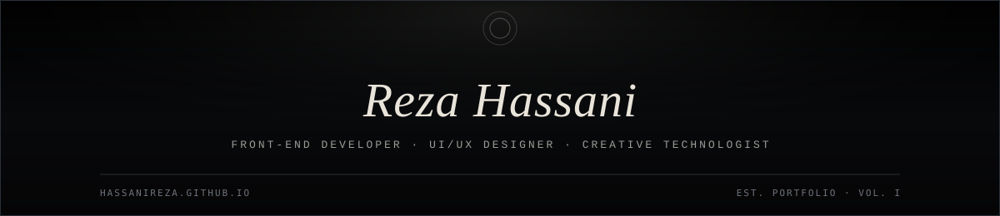
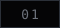
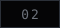
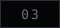
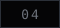
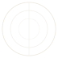
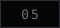
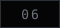
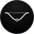
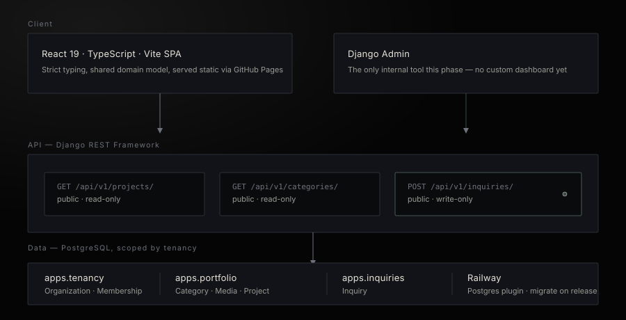

  

 

 

## &nbsp;&nbsp;About

<table>
<tr>
<td width="65%" valign="top">

I build production-grade interfaces where technical rigor meets visual craft: component architecture, design systems, motion, and full-stack integration, with accessibility and performance treated as requirements rather than finishing touches.

I work the seam between mockup and shipped product, holding engineering discipline and design judgment to the same standard so the distance between the two stays as close to zero as possible.

</td>
<td width="35%" valign="top">

**Core Strengths**

▸ Design-to-code, Figma to production CSS
▸ Accessible, responsive interface engineering
▸ Motion and interaction design
▸ Design systems at scale
▸ Django and Wagtail integration

</td>
</tr>
</table>

 

## &nbsp;&nbsp;Portfolio Website

 

This repository is also the source for my personal site: a fully typed React and TypeScript single-page application, rebuilt from the ground up and deployed automatically to GitHub Pages on every push to `main`.

<table align="center">
<tr>
<td width="60%" valign="top">

**What it does**

- Landing page with a canvas-based particle field animation
- A portfolio grid pulling from a single typed data source, so adding a project is a two-line edit, not a layout change
- A contact form protected by Cloudflare Turnstile, submitting through Formspree
- A branded 404 page for any unmatched route, styled to match the rest of the site
- Zero manual deploys: CI lints, type-checks, builds, and publishes on every push

</td>
<td width="40%" valign="top">

**Built with**

 
 
 
 
 
 

</td>
</tr>
</table>

 

## &nbsp;&nbsp;Tech Stack

<table align="center">

<tr>
<td align="center" valign="top" width="25%">

**Front-End**
  
 
 
 
 
 

</td>
<td align="center" valign="top" width="25%">

**Back-End & CMS**
  
 
 
 
 

</td>
<td align="center" valign="top" width="25%">

**Design & Creative**
  
 
 
 
 

</td>
<td align="center" valign="top" width="25%">

**Tooling**
  
 
 
 

</td>
</tr>

</table>

 

## &nbsp;&nbsp;Design Philosophy

<table align="center">
<tr>
<td align="center" width="25%" valign="top">

**User-First**
 
Every decision traces back to how someone actually interacts with the product.

</td>
<td align="center" width="25%" valign="top">

**Component Integrity**
 
Clean abstractions and consistent patterns that scale without friction.

</td>
<td align="center" width="25%" valign="top">

**Accessible by Default**
 
Not a finishing touch. A baseline requirement from day one.

</td>
<td align="center" width="25%" valign="top">

**Performance as UX**
 
Speed and responsiveness are features, not post-launch fixes.

</td>
</tr>
</table>

 

 

> *"The best interfaces feel effortless. Getting there takes everything."*

 

## &nbsp;&nbsp;Brand & Art Direction

 

Every project I ship carries a written brand system before a single line of interface code, defining palette, typography, tone, and the rules that keep a visual identity disciplined instead of decorative. The direction below governs **Abyssal Liturgy**, a ceremonial identity built for the edge of land and sea, where fashion, ritual, and biological form are treated as forgotten religious painting, submerged for centuries.

| Void | Charcoal | Cold Slate | Ash Gray | Bone White | Bio Residue |
|:---:|:---:|:---:|:---:|:---:|:---:|
|  |  |  |  |  |  |
| `#050506` | `#111318` | `#2b3038` | `#6d727b` | `#e9e4da` | `#3c4b46` |

**Governing rule:** ninety-five percent black, one light source, texture over color as the primary signal. [View the brand and art direction →](https://hassanireza.github.io/branding)

 

## &nbsp;&nbsp;Highlighted Project

  

### [Undertow](https://hassanireza.github.io/undertow/)
Web design & motion graphics studio | full-stack, live demo

A studio site built on a single premise: restraint is a design choice, not an absence of one. Undertow is a fictional web design and motion graphics studio, brought to life as a full-stack React and Django application, one clear hierarchy, considered type, and motion that earns its place, nothing added because it was easy, nothing left in because no one questioned it.

 

The front end is a strict-TypeScript React SPA served from Vite, with a class-based domain model shared across the codebase. The back end is Django and Django REST Framework, structured around multi-tenant scoping (`Organization`, `Membership`) so the same codebase can serve more than one studio without a rewrite, a public read-only API for the portfolio, a write-only endpoint for inquiries, and Django admin as the only internal tool by design, no dashboard to maintain until there's a reason for one.

 

  
Reza Hassani &nbsp;&middot;&nbsp; Front-End Developer &nbsp;&middot;&nbsp; UI/UX Designer &nbsp;&middot;&nbsp; Creative Technologist

